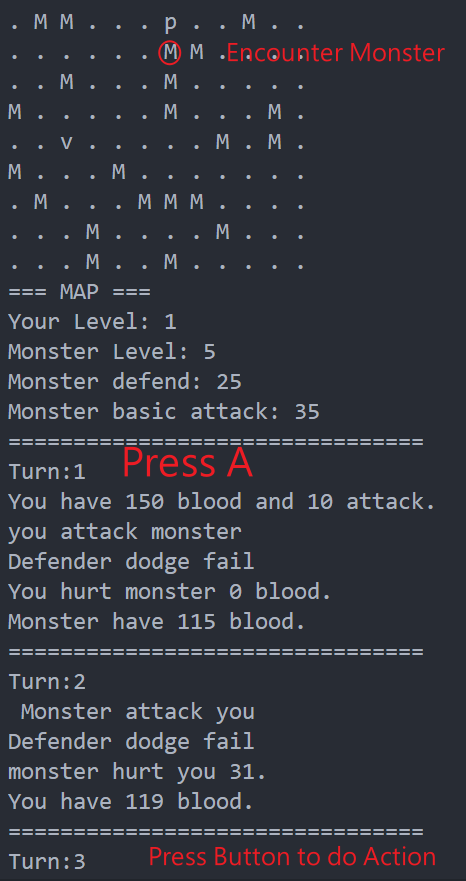

# Easy RPG Game

A easy Maze RPG game which maze size you decide

## Demo

1. Begin
   

2. Chose birth position
   

3. Attack


4. Go to Village


5. ADD Weapon


6. Buy Medical or Recovery


## Install

```sh
gcc easy_game.c
.\a.exe
```

## Playing Method

1. Decide map size:
Player can specify size of the map and the birth location ,then the game begin and the player use keyboard to play .
2. Keyboard command:
   ↑↓← →:move up , down , left , right
   A: (Attack)
   B: (Bag)
   L: (show Level)
   U: (Level up)
   E: (Escape)
   1~9
3. Game end:
   When the player defeats all the monster , player wins and the game ends.
    The other method to end the game is press E.
